# Lembar Kerja 2: Arsitektur Informasi & Sitemap
**Praktik Aplikasi Web (INF60295) — Pertemuan 3**  
**Sistem Peminjaman Ruang dan Peralatan Kampus "SIPINJAM"**

---

### Informasi Tim
- **Ivan Maulana Bahtiar** (24051130047)
- **Yuki Ramadhan** (24051130053)
- **Risky Aditya Pratama** (24051130057)
- **Arfa Novan Akbar** (24051130058)

---

## 1. Ikhtisar Struktur Navigasi

Aplikasi web SIPINJAM dirancang dengan pemisahan peran yang tegas antara **Mahasiswa** (pengguna pemohon peminjaman) dan **Petugas Sarana & Prasarana** (pengguna pengelola & verifikator). Pemisahan ini memastikan setiap persona memiliki alur kerja yang fokus, efisien, dan bebas distraksi:

```
SIPINJAM Information Architecture
├── 1. Portal Mahasiswa (Mobile-First)
│   ├── M01 Beranda / Cari Ruang
│   │   └── M01-R Hasil Pencarian Ruang
│   ├── M02 Detail Ruang
│   ├── M03 Formulir Pengajuan Peminjaman
│   │   └── M03-ERROR Validasi Form Gagal
│   └── M04 Status Pengajuan
│       ├── M04-PENDING Status: Menunggu Verifikasi
│       ├── M04-APPROVED Status: Disetujui
│       └── M04-REJECTED Status: Ditolak (+ Catatan Alasan)
│
└── 2. Portal Petugas Sarpras (Desktop-First)
    ├── D01 Dashboard Utama (Statistik & Pengajuan Baru)
    ├── D02 Daftar Pengajuan (Tabel, Filter, & Search)
    └── D03 Detail & Verifikasi Pengajuan
        ├── D03-ALERT Peringatan Bentrok Jadwal
        ├── D03-APPROVED Konfirmasi Persetujuan
        └── D04 Modal Tolak Pengajuan (Input Alasan)
            └── D03-REJECTED Notifikasi Status Ditolak
```

---

## 2. Diagram Pohon Sitemap (Mermaid)

```mermaid
graph TD
    subgraph Portal_Mahasiswa["Portal Mahasiswa (Mobile Web)"]
        M01["M01: Beranda & Cari Ruang"] -->|Input kriteria & Klik Cari| M01R["M01-R: Hasil Pencarian Ruang"]
        M01R -->|Pilih Salah Satu Ruang| M02["M02: Detail Ruang"]
        M02 -->|Klik 'Ajukan Peminjaman'| M03["M03: Form Pengajuan"]
        M03 -->|Submit Form Lengkap| M04P["M04: Status (Menunggu Verifikasi)"]
        M03 -->|Submit Form Kosong/Salah| M03E["M03-ERROR: Form Tidak Lengkap"]
        M03E -->|Perbaiki Isian Form| M03
        M04P -.->|Setelah Diproses Petugas| M04A["M04: Status (Disetujui)"]
        M04P -.->|Setelah Diproses Petugas| M04R["M04: Status (Ditolak + Alasan)"]
    end

    subgraph Portal_Petugas["Portal Petugas Sarpras (Desktop Web)"]
        D01["D01: Dashboard Petugas"] -->|Klik Menu Pengajuan / Ringkasan| D02["D02: Daftar Pengajuan"]
        D02 -->|Klik Tombol 'Detail'| D03["D03: Detail & Verifikasi Pengajuan"]
        D03 -->|Tidak Ada Bentrok -> Klik 'Setujui'| D03A["D03-APPROVED: Status Disetujui"]
        D03 -->|Ada Bentrok / Tidak Valid -> Klik 'Tolak'| D04["D04: Modal Tolak Pengajuan"]
        D04 -->|Isi Alasan & Klik 'Konfirmasi Tolak'| D03R["D03-REJECTED: Status Ditolak"]
        D04 -->|Klik 'Batal'| D03
    end
```



---

## 3. Rincian Halaman Portal Mahasiswa

| ID Layar | Nama Halaman | Peran | User Story Sumber | Tujuan Halaman | Navigasi Masuk | Navigasi Keluar |
| :--- | :--- | :--- | :--- | :--- | :--- | :--- |
| **M01** | Beranda / Cari Ruang | Mahasiswa | US-01 | Menampilkan filter tanggal dan kapasitas, serta kartu rekomendasi ruang populer. | Akses awal aplikasi / Bottom nav "Beranda" / Tombol kembali dari M02. | Form pencarian → M01-R (Hasil Cari); Kartu ruang → M02 (Detail Ruang). |
| **M01-R** | Hasil Pencarian Ruang | Mahasiswa | US-01 | Menampilkan daftar ruang yang memenuhi kriteria tanggal dan kapasitas minimum (atau pesan kosong bila tidak ada). | Tombol "Cari Ruang" dari M01. | Pilih kartu ruang → M02; Ubah kriteria filter → M01. |
| **M02** | Detail Ruang | Mahasiswa | US-01 | Menyajikan foto, kapasitas maksimal, lokasi gedung, fasilitas terpasang, dan indikator status ketersediaan. | Klik ruang dari M01 atau M01-R. | Tombol Kembali → M01; Tombol "Ajukan Peminjaman" → M03. |
| **M03** | Formulir Pengajuan | Mahasiswa | US-02 | Menyediakan formulir isian tanggal, waktu mulai-selesai, jumlah peserta, keperluan acara, dan kontak penanggung jawab. | Tombol "Ajukan Peminjaman" pada M02. | Tombol Batal/Kembali → M02; Tombol "Kirim Pengajuan" → M04 (jika valid) atau M03-ERROR (jika belum lengkap). |
| **M03-ERROR** | Validasi Form Gagal | Mahasiswa | US-02 (AC-05) | Menampilkan pesan peringatan field wajib yang belum terisi (*inline error validation*). | Tombol "Kirim Pengajuan" ditekan saat form belum lengkap. | Memperbaiki isian data pada M03. |
| **M04** | Status Pengajuan | Mahasiswa | US-02 (AC-06), US-03 | Menampilkan bukti nomor pengajuan (tiket) dan visualisasi timeline status pengajuan. | Otomatis setelah submit M03 sukses; atau riwayat pengajuan aktif. | Tombol "Kembali ke Beranda" → M01. |
| **M04-APPROVED** | Status Disetujui | Mahasiswa | US-03 (AC-11) | Menampilkan badge hijau "Disetujui" beserta petunjuk pengambilan izin/kunci di sarpras. | Dibuka dari daftar status tiket ketika petugas telah memverifikasi. | Tombol "Kembali ke Beranda" → M01. |
| **M04-REJECTED** | Status Ditolak | Mahasiswa | US-03, US-09 | Menampilkan badge merah "Ditolak" beserta kotak alasan penolakan dari petugas. | Dibuka dari daftar status tiket ketika pengajuan ditolak petugas. | Tombol "Cari Ruang Lain" → M01. |

---

## 4. Rincian Halaman Portal Petugas Sarpras

| ID Layar | Nama Halaman | Peran | User Story Sumber | Tujuan Halaman | Navigasi Masuk | Navigasi Keluar |
| :--- | :--- | :--- | :--- | :--- | :--- | :--- |
| **D01** | Dashboard Petugas | Petugas Sarpras | US-07 | Menyajikan ringkasan metrik statistik (Total Pengajuan, Menunggu Verifikasi, Disetujui, Ditolak) dan tabel 5 pengajuan terkini. | Login petugas / Klik menu sidebar "Dashboard". | Klik kartu metrik / menu sidebar → D02 (Daftar Pengajuan); Klik baris pengajuan → D03. |
| **D02** | Daftar Pengajuan | Petugas Sarpras | US-07 | Menampilkan seluruh permohonan peminjaman dalam bentuk tabel komprehensif yang dilengkapi fitur pencarian nama/ID dan filter status. | Menu sidebar "Daftar Pengajuan" / Tombol "Lihat Semua" dari D01. | Klik baris tabel / tombol "Detail" → D03; Klik sidebar menu → D01. |
| **D03** | Detail & Verifikasi Pengajuan | Petugas Sarpras | US-07 (AC-10..12) | Menampilkan profil pemohon, detail acara, jadwal penggunaan, status bentrok otomatis, serta tombol aksi keputusan. | Tombol "Detail" pada baris tabel D02 atau D01. | Tombol Kembali → D02; Tombol "Setujui" → Dialog konfirmasi & update status; Tombol "Tolak" → D04 (Modal Tolak). |
| **D04** | Modal Tolak Pengajuan | Petugas Sarpras | US-09 | Menyediakan formulir dialog untuk menginput alasan penolakan secara spesifik sebelum status diubah. | Tombol "Tolak" pada halaman D03. | Tombol "Batal" → Menutup modal dan kembali ke D03; Tombol "Konfirmasi Tolak" → Menyimpan alasan dan mengubah status pengajuan menjadi Ditolak. |
