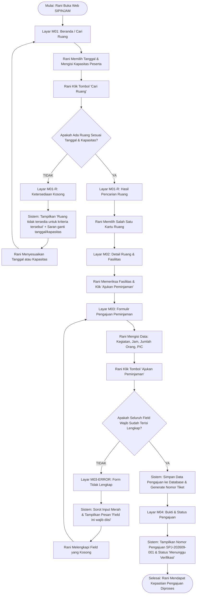

# Lembar Kerja 3: User Flow Pengguna (Mahasiswa)
**Praktik Aplikasi Web (INF60295) — Pertemuan 3**  
**Sistem Peminjaman Ruang dan Peralatan Kampus "SIPINJAM"**

---

### Informasi Tim
- **Ivan Maulana Bahtiar** (24051130047)
- **Yuki Ramadhan** (24051130053)
- **Risky Aditya Pratama** (24051130057)
- **Arfa Novan Akbar** (24051130058)

---

## 1. Ikhtisar Alur Pengguna Mahasiswa

User Flow Mahasiswa menggambarkan perjalanan **Rani (Ketua Panitia Mahasiswa)** saat mencari ruang rapat/seminar untuk kegiatannya melalui perangkat *mobile*, memeriksa ketersediaan, mengisi data peminjaman, menangani kemungkinan kesalahan formulir atau ketiadaan ruang, hingga menerima bukti nomor pengajuan berstatus **Menunggu Verifikasi**.

---

## 2. Diagram Alur Pengguna (Mermaid)

---

## 3. Matriks Rincian Langkah Interaksi (Step-by-Step)

| No | Tahapan Alur | Aktor | Aksi Pengguna | Respons Sistem | Decision Point | Layar Terkait | Acceptance Criteria Terkait |
| :---: | :--- | :--- | :--- | :--- | :---: | :---: | :---: |
| **1** | Akses Beranda | Mahasiswa | Membuka URL SIPINJAM pada browser ponsel | Menampilkan antarmuka beranda, sambutan, dan widget pencarian | - | **M01** | - |
| **2** | Input Kriteria | Mahasiswa | Memilih tanggal peminjaman (misal: 20 September 2026) dan input kapasitas (misal: 50 orang) | Memperbarui state input form pencarian secara interaktif | - | **M01** | `AC-01`, `AC-02` |
| **3** | Submit Pencarian | Mahasiswa | Menekan tombol "Cari Ruang" | Melakukan query filter database berdasarkan tanggal dan batas kapasitas $\ge 50$ | Ada ruang tersedia? | **M01** | `AC-01`, `AC-02` |
| **4a** | **Kasus Gagal: Ruang Kosong** | Mahasiswa | Melihat tampilan hasil pencarian kosong | Menampilkan pesan: *"Ruang tidak tersedia untuk kriteria tersebut. Silakan pilih tanggal lain atau sesuaikan kapasitas"* | Ubah kriteria? | **M01-R** | `AC-03` |
| **4b** | **Kasus Sukses: Ruang Tersedia** | Mahasiswa | Melihat daftar kartu ruang yang memenuhi syarat (misal: Ruang Seminar B, Aula Utama) | Menampilkan foto thumbnail, nama ruang, kapasitas, dan badge ketersediaan "Tersedia" | Pilih ruang | **M01-R** | `AC-01`, `AC-02` |
| **5** | Periksa Detail | Mahasiswa | Menekan kartu "Ruang Seminar B" | Membuka halaman detail: kapasitas 60 kursi, fasilitas (AC, Proyektor, 2 Mic), lokasi Lantai 2 Gedung C | Lanjut ajukan? | **M02** | `US-01` |
| **6** | Mulai Pengajuan | Mahasiswa | Menekan tombol CTA "Ajukan Peminjaman" | Mengarahkan ke formulir pengajuan peminjaman dan mengunci data ruang terpilih | - | **M03** | `US-02` |
| **7** | Isi Formulir | Mahasiswa | Mengisi jam mulai (09.00), jam selesai (12.00), nama acara, penanggung jawab, dan nomor kontak | Menampung input teks dan waktu pada formulir | - | **M03** | `AC-04` |
| **8** | Kirim Pengajuan | Mahasiswa | Menekan tombol "Ajukan Peminjaman" | Menjalankan validasi kelengkapan seluruh *mandatory fields* | Form lengkap & valid? | **M03** | `AC-04`, `AC-05` |
| **9a** | **Kasus Gagal: Form Belum Lengkap** | Mahasiswa | Membaca pesan error yang disorot merah pada formulir | Menolak penyimpanan form, memunculkan teks inline *"Field ini wajib diisi"* pada kolom yang kosong | Perbaiki isian | **M03-ERROR** | `AC-05` |
| **9b** | **Kasus Sukses: Form Lengkap** | Mahasiswa | Menunggu konfirmasi sistem | Menyimpan data pengajuan, menghasilkan nomor tiket unik (contoh: `#SPJ-0824`), menyetel status *"Menunggu Verifikasi"* | - | **M04** | `AC-04`, `AC-06` |
| **10** | Tinjau Status Tiket | Mahasiswa | Membaca rincian bukti pengajuan pada layar ponsel | Menampilkan timeline progres: [1] Pengajuan Terkirim (Selesai) → [2] Verifikasi Sarpras (Aktif) → [3] Keputusan | Selesai / Pantau berkala | **M04** | `AC-06`, `US-03` |

---

## 4. Evaluasi Bebas Jalan Buntu (*No Dead Ends Guarantee*)

- Pada **Kasus Ruang Tidak Tersedia (`AC-03`)**: Sistem tidak membiarkan layar kosong membingungkan pengguna, melainkan menyediakan tombol *"Atur Ulang Pencarian"* yang membawa pengguna kembali ke widget input `M01` dengan isian sebelumnya tetap tersimpan agar mudah diedit.
- Pada **Kasus Validasi Gagal (`AC-05`)**: Sistem mempertahankan data yang sudah diisi pengguna sebelumnya dan mengarahkan fokus kursor ke field yang belum lengkap, sehingga pengguna tidak perlu mengetik ulang dari awal.
- Pada **Halaman Sukses (`M04`)**: Terdapat tombol jelas *"Kembali ke Beranda"* dan *"Simpan Bukti Pengajuan (PDF/Screenshot)"* untuk mempermudah koordinasi panitia.
