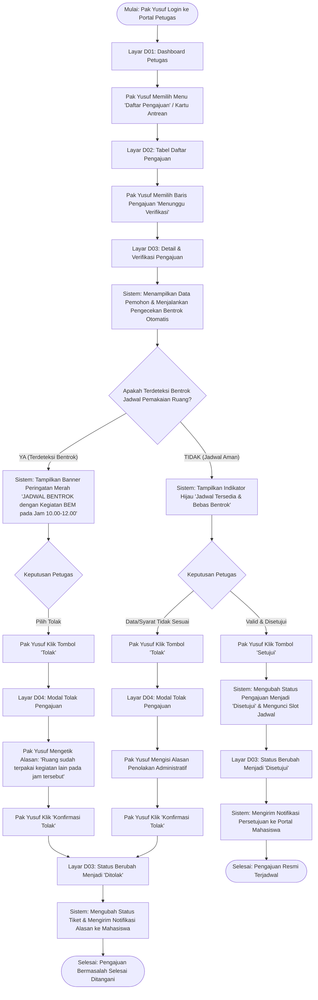

# Lembar Kerja 4: User Flow Petugas Sarana & Prasarana
**Praktik Aplikasi Web (INF60295) — Pertemuan 3**  
**Sistem Peminjaman Ruang dan Peralatan Kampus "SIPINJAM"**

---

### Informasi Tim
- **Ivan Maulana Bahtiar** (24051130047)
- **Yuki Ramadhan** (24051130053)
- **Risky Aditya Pratama** (24051130057)
- **Arfa Novan Akbar** (24051130058)

---

## 1. Ikhtisar Alur Kerja Petugas

User Flow Petugas menggambarkan alur kerja harian **Pak Yusuf (Petugas Sarana & Prasarana)** dalam memverifikasi pengajuan peminjaman ruang yang masuk secara terpusat melalui komputer kerja desktop. Alur mencakup pengecekan antrean, pemeriksaan detail pemohon dan jadwal, penanganan otomatis terhadap bentrok jadwal pemakaian, serta pengambilan keputusan persetujuan (*approval*) atau penolakan dengan alasan objektif (*rejection with reason*).

---

## 2. Diagram Alur Kerja Petugas (Mermaid)

---

## 3. Matriks Rincian Langkah Interaksi Petugas

| No | Tahapan Alur | Aktor | Aksi Pengguna | Respons Sistem | Decision Point | Layar Terkait | Acceptance Criteria Terkait |
| :---: | :--- | :--- | :--- | :--- | :---: | :---: | :---: |
| **1** | Akses Dashboard | Petugas | Membuka portal admin pada komputer kerja | Menampilkan dashboard metrik: total pengajuan, antrean verifikasi, dan statistik bulanan | - | **D01** | `US-07` |
| **2** | Buka Antrean | Petugas | Mengklik menu "Daftar Pengajuan" atau kartu "Menunggu Verifikasi" | Memuat tabel seluruh permohonan peminjaman yang masuk secara berurutan (*FIFO*) | - | **D02** | `AC-10` |
| **3** | Buka Detail | Petugas | Mengklik tombol "Detail" pada permohonan mahasiswa (contoh: `#SPJ-0824`) | Memuat halaman periksa komprehensif: Nama Pemohon, Ormawa, Tanggal, Jam, Ruang, dan Keperluan | - | **D03** | `AC-10` |
| **4** | Deteksi Bentrok | Sistem | - | Memindai jadwal ruang pada database untuk tanggal dan rentang waktu yang diajukan | Jadwal bentrok dengan pengajuan lain yang sudah disetujui? | **D03** | `AC-11`, `AC-12` |
| **5a** | **Kondisi Bentrok Ditemukan** | Sistem | - | Menampilkan alert bar merah di bagian atas: *"PERINGATAN: Jadwal bentrok dengan pengajuan #SPJ-0790 (Seminar Nasional BEM, 09.00 - 13.00)"* | Petugas mengevaluasi | **D03** (State Alert) | `AC-12` |
| **6a** | Ambil Tindakan Penolakan | Petugas | Menekan tombol "Tolak" berwarna merah pada panel aksi | Membuka modal dialog *pop-up* formulir penolakan | - | **D04** | `US-09` |
| **7a** | Input Alasan Penolakan | Petugas | Mengisi textarea alasan: *"Jadwal bertabrakan dengan agenda resmi fakultas. Silakan ajukan di sesi sore atau gunakan Ruang C"* | Menampung teks alasan dan memvalidasi bahwa kolom alasan tidak boleh kosong | Alasan sudah diisi? | **D04** | `US-09` |
| **8a** | Konfirmasi Tolak | Petugas | Menekan tombol "Konfirmasi Tolak Pengajuan" | Mengubah status tiket menjadi "Ditolak", menyimpan rekaman log alasan, dan menutup modal | Selesai | **D03** (State Rejected) | `US-09`, `US-03` |
| **5b** | **Kondisi Aman / Tidak Bentrok** | Sistem | - | Menampilkan badge hijau *"Jadwal Terverifikasi: Tidak Ada Benturan Jadwal"* | Petugas mengevaluasi kelayakan acara | **D03** | `AC-11` |
| **6b** | Keputusan Persetujuan | Petugas | Menekan tombol "Setujui" berwarna hijau tua | Menampilkan dialog konfirmasi singkat *"Apakah Anda yakin menyetujui peminjaman ini?"* | Konfirmasi ya? | **D03** | `AC-11` |
| **7b** | Finalisasi Persetujuan | Petugas | Mengklik tombol konfirmasi "Ya, Setujui" | Mengubah status pengajuan menjadi "Disetujui", mengunci slot ruang pada database, dan memperbarui tampilan tabel | Selesai | **D03** (State Approved) | `AC-11`, `US-03` |

---

## 4. Evaluasi Bebas Jalan Buntu (*No Dead Ends Guarantee*)

- **Modal Dialog Pembatalan**: Pada modal penolakan (`D04`), jika petugas berubah pikiran atau salah klik, disediakan tombol *"Batal"* yang secara instan menutup modal tanpa mengubah status data apa pun.
- **Navigasi Balik yang Konsisten**: Pada halaman detail pengajuan (`D03`), terdapat tautan *Breadcrumb* `Dashboard > Daftar Pengajuan > #SPJ-0824` dan tombol *"Kembali ke Daftar"* di bagian atas, menjamin petugas tidak terjebak pada layar detail setelah memproses satu tiket.
- **Pembaruan Status Real-Time**: Setelah status disetujui atau ditolak, tombol aksi ("Setujui" & "Tolak") dinonaktifkan (*disabled*) dan digantikan oleh label status permanen beserta log waktu keputusan, mencegah terjadinya klik ganda (*double execution*).
